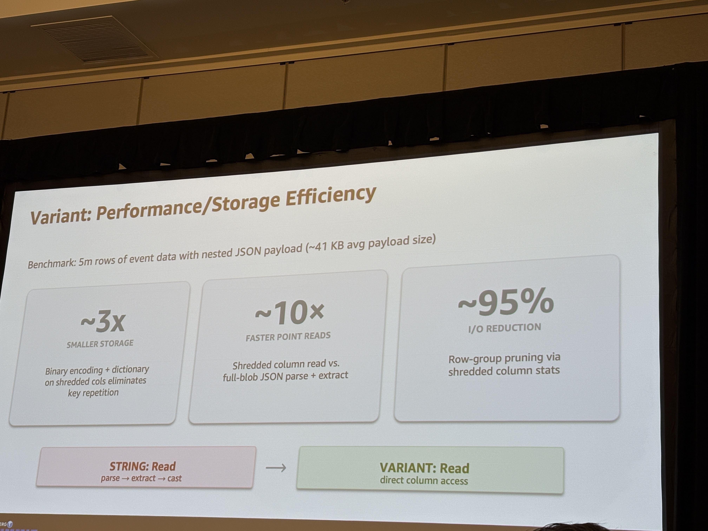
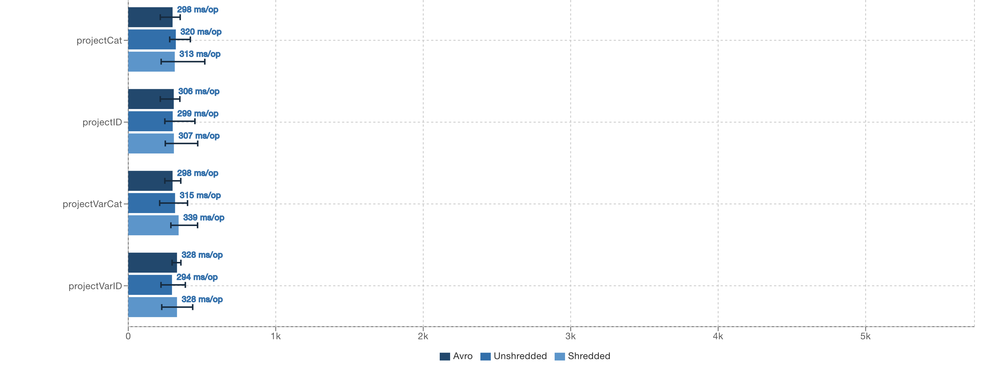
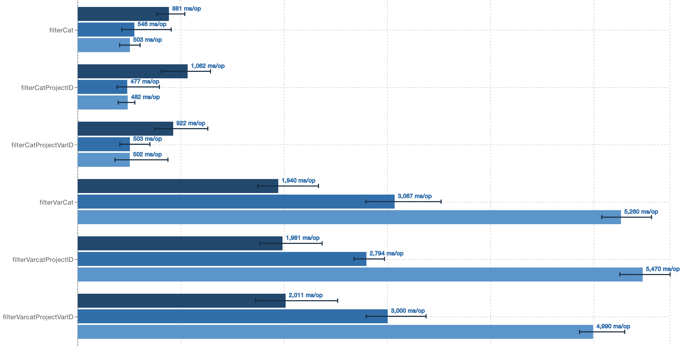
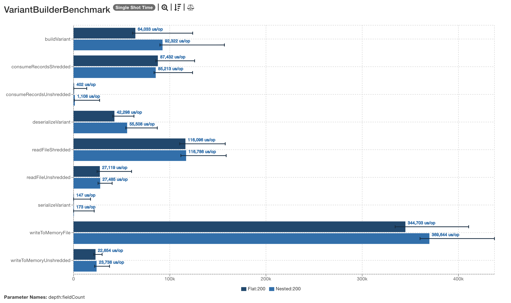
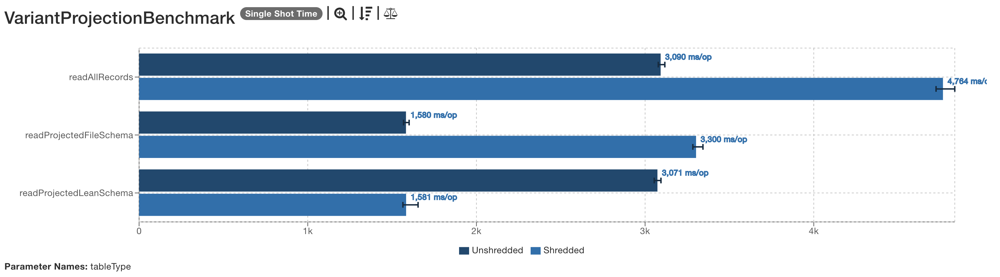
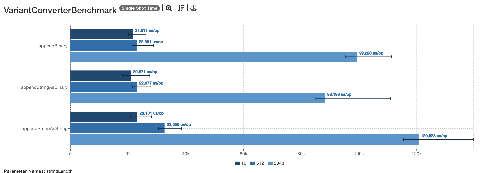

# Benchmarking Parquet Variants through Iceberg

#### Steve Loughran,
#### April 2026

## Key Questions
1. Are variants ready to use?
2. If not, what is needed?

## Answers

1. They can be slow when filtering on a field within a variant, shredded or not.
2. Spark SQL queries do not show performance issues when projecting a field within a variant.
3. The parquet-java library has some odd behaviour related to the schema used when reading a file.
4. Profiling has identified some easy gains in Parquet's variant code; there's active work addressing this.
   Iceberg's implementation is ahead here. 
5. What is needed?
   * Predicate pushdown all the way from Iceberg to the Parquet reader
   * The causes of the "unexpected outcomes" in the benchmarking experiments to be identified and addressed.
     This could include identifying flaws in the benchmarks: review of those PRs is needed to give convidence in their conclusions.
   * The Parquet-java variant support to borrow more from Iceberg.
   * An Iceberg benchmark run with all the pending PRs merged to see what difference that makes. 

At the time of the writing of the initial document (10-04-2026) the benchmark results imply that it is faster to perform filtering on variant data stored in Avro in Iceberg + Spark queries than it is on data stored in Parquet -and that shredded variants are the worst.
This should not be the case.

## Relevant Issues and Pull Requests

This is a list of PRs by myself, Qiegang Long and others which should improve query/read time.
Sorted numerically by project.

| Project | Issue/PR                                                       | Title                                                                                  | Author         |
|---------|----------------------------------------------------------|----------------------------------------------------------------------------------------|----------------|
| Iceberg | [14707](https://github.com/apache/iceberg/issues/14707)  | Vectorized read for variant                                                            | enriquh        |
| Iceberg | [15510](https://github.com/apache/iceberg/issues/15510)  | Parquet Rowgroup skipping for variant predicate                                        | Qiegang Long   |
| Iceberg | [15629](https://github.com/apache/iceberg/pull/15629)    | *Core, Spark: Add JMH benchmarks for Variants*                                         | Steve Loughran |
| Spark   | [54598](https://github.com/apache/spark/pull/54598)      | Enable Parquet rowgroup skipping for variant filters to improve query-time performance | Qiegang Long   |
| Spark   | [54394](https://github.com/apache/spark/pull/54394)      | Support variant_get predicate for DSv2 filter pushdown                                 | Qiegang Long   |
| Parquet | [3452](https://github.com/apache/parquet-java/pull/3452) | *GH-3451. Add a JMH benchmark for variants*                                            | Steve Loughran |
| Parquet | [3481](https://github.com/apache/parquet-java/pull/3481) | *Optimizing Variant read path with lazy caching*                                       | Neelesh Salian |

This document only covers benchmarks from the two issues marked in italics: one in Iceberg and one in Parquet-java. 
A full stack built with all PRs is expected to be faster, especially through file pushdown and use of the vectorized reader.

## Related Work

[_Preliminary Notes on Open-Source Variant Performance_](https://qlong.github.io/posts/2026-03-30-variant-early-results/),
Qiegang Long, March 2026.

This compared shredded and unshredded variant performance with raw JSON, using spark and iceberg tables,
using 4M rows of the real-world semi-structured GitHub Archive (GHA) dataset as test data.

The fastest format for querying data was JSON in Spark tables; the worst a shredded variant in a Spark Native table.

> As of March 2026, if you are expecting a massive, out-of-the-box performance leap by simply switching to Variant in open-source Spark 4, our preliminary results suggest the engine implementations and defaults might still need some time to mature.


 _"The Evolution of Semi-Structured Data: Moving from JSON Strings to Iceberg V3 Variants"_, April 2026.
Arun Shanmugam and Suthan Phillips here report a 10x speedup using VARIANT over JSON blobs,
and 95% I/O reduction.



This was on a dataset of 5M rows with 41 kb of JSON data nested in each row, processed through Amazon EMR.


All experiments reported a saving in space, especially in shredded variants, where classic Parquet column compression
strategies can be applied.
The benchmarks in this document also saw significant space savings -they just aren't being reported as that's not
the topic of the investigation.
Ideally we would want parquet files containing shredded variants which are small in size *and fast to read*.
This benchmark and Qiegang Long's work imply there is work to be done here.

# Benchmark Design and Test Setup

Two core benchmark suites were written for Parquet And Spark, to measure:
1. Time to construct variants through builders.
2. Time to read data from a file containing shredded and unshredded variants.
3. Impact of deeper nesting of structures.

In both Iceberg and Spark, Variant Builder performance appears to be functional with `O(depth + field-count)` scalability.
Deeply nested structures consume memory because the Java `HashMap` instances constructed at each level preallocate space for 16 entries.

Because there are no suprises here, these results are not covered in this report.
The results are available as [html](./results/iceberg) and [JSON](./json).

What is signficant is that reading data from files, with a simple test structure, produced disappointing results.
Not only are variants slow to process in queries, shredded variants are often even slower to process.

### File Schema

Each Parquet record has a simple structure designed to:
* Support queries against Parquet or variant fields mapped to the same integer values.
* Contain some strings to be slightly more realistic of the declared uses of variants. 

The variant doesn't include any nested values, floating point values, and is very small.
As such it is likely to have smaller manifests and a shorter parse time than more advanced
uses of the datatype.
Bear this in mind: _the overheads of per-record manifest parsing may be under-represented_ in these benchmarks.


```
id: long -> unique per row
category: int32  (0-19)
nested: variant
    .idstr: string -> id as string
    .varid: int64  -> id
    .varcategory: int32 -> category (0-19). 0-9 or 10-19 per file
    .col4: string -> 20 values from category
```

The `id` Column is is a row counter. `category` is calculated from the file number and ID, such that
all associated RowGroup in a file will either be in the range 0-9 or the range 10-19.
RowGroup filtering based on statistics should rapidly identify which rows can be skipped,
If file statistics were collected, entire files could be omitted from the filtering.

Here is the Iceberg row construction code, which uses Iceberg structures and types:

```java
private void writeOneFile(DataWriter<Record> writer, VariantMetadata metadata, int fileNum)
    throws IOException {
  try (writer) {
    GenericRecord record = GenericRecord.create(SCHEMA);
    int categoryBase = (fileNum % 2) * 10;
    for (int i = 0; i < NUM_ROWS_PER_FILE; i++) {
      long id = (long) fileNum * NUM_ROWS_PER_FILE + i;
      int category = (int) (id % 10) + categoryBase;
      Variant variant = buildVariant(metadata, id, category, repeatedStrings[category]);
      writer.write(
          record.copy(ImmutableMap.of("id", id, "category", category, "nested", variant)));
    }
  }
}

private static Variant buildVariant(
  VariantMetadata metadata, long id, int category, String col4) {
  ShreddedObject obj = Variants.object(metadata);
  obj.put("idstr", Variants.of("item_" + id));
  obj.put("varid", Variants.of(id));
  obj.put("varcategory", Variants.of(category));
  obj.put("col4", Variants.of(col4));
  return Variant.of(metadata, obj);
}
```

The Iceberg schema is minimal, as none of the fields within the variant are defined.
```java
private static final Schema SCHEMA =
  new Schema(
      required(1, "id", Types.LongType.get()),
      required(2, "category", Types.IntegerType.get()),
      required(3, "nested", Types.VariantType.get()));
```

The Parquet module tests define a schema contaning a group `nested` of containing two required binary fields, `metadata` and `value`:

```parquet
message vschema {
  required int64 id;
  required int32 category;
  required group nested (VARIANT(1)) {
    required binary metadata;
    required binary value;
  }
}
```

When writing a shredded Parquet file in the Parquet benchmarks, the schema was expanded to declare that there was an optional group `typed_value`, inside which each shredded element was declared with full type information.

```parquet
message vschema {
  required int64 id;
  required int32 category;
  required group nested (VARIANT(1)) {
    required binary metadata;
    optional binary value;
    optional group typed_value {
      required group idstr { optional binary value; optional binary typed_value (STRING); }
      required group varid { optional binary value; optional int64 typed_value; }
      required group varcategory { optional binary value; optional int32 typed_value; }
      required group col4 { optional binary value; optional binary typed_value (STRING); }
    }
  }
}
```

Manual verification that the files generated through Iceberg were consistent with this schema was performed through the Parquet cli `schema` command:

```
Properties:
  iceberg.schema: {"type":"struct","schema-id":0,"fields":[{"id":1,"name":"id","required":true,"type":"long"},{"id":2,"name":"category","required":true,"type":"int"},{"id":3,"name":"nested","required":true,"type":"variant"}]}
Schema:
message table {
  required int64 id = 1;
  required int32 category = 2;
  required group nested (VARIANT(1)) = 3 {
    required binary metadata;
    optional binary value;
    optional group typed_value {
      required group col4 {
        optional binary value;
        optional binary typed_value (STRING);
      }
      required group idstr {
        optional binary value;
        optional binary typed_value (STRING);
      }
      required group varcategory {
        optional binary value;
        optional int32 typed_value;
      }
      required group varid {
        optional binary value;
        optional int64 typed_value;
      }
    }
  }
}
```


## Methods

All benchmarks were implemented as JMH benchmarks within the Parquet and Iceberg
source trees, in `parquet-benchmark` for Parquet and `core/src/jmh` and `spark/v4.1/spark` for Iceberg

# Iceberg Benchmarks


The Iceberg query benchmarks generated the a test dataset as: Parquet Unshredded, Parquet Shredded and Avro.
Variants are stored in the Avro files using Iceberg's variant ser/deser code.


## Table setup

Tables were generated within the local filesystem of four files, each with 250,000 elements,
resulting into 1M records overall.
* Compression was disabled.
* Partitioning was not enabled.
* In the absence of of [#14707 Vectorized read for variant](https://github.com/apache/iceberg/issues/14707) vectorization was disabled.    
* The entire table was created in a single commit.

```java
protected Table initTable() {
  HadoopTables tables = new HadoopTables(hadoopConf());
  Map<String, String> properties = Maps.newHashMap();
  properties.put(TableProperties.FORMAT_VERSION, "3");
  properties.put(TableProperties.SPLIT_OPEN_FILE_COST, Integer.toString(128 * 1024 * 1024));
  // turn off compression to remove it as a factor.
  properties.put(TableProperties.METADATA_COMPRESSION, "none");
  properties.put(TableProperties.PARQUET_COMPRESSION, "none");
  properties.put(TableProperties.AVRO_COMPRESSION, "none");
  // variant projection pushdown not supported with the vectorized reader.
  properties.put(TableProperties.PARQUET_VECTORIZATION_ENABLED, "false");

  return tables.create(SCHEMA, PartitionSpec.unpartitioned(), properties, newTableLocation());
}

```
## Queries

Each benchmark measures the time to complete a single Spark SQL query against the current test table, all taking he form of a simple SELECT statement, statements such as

```sql
SELECT variant_get(nested, '$.varid', 'int') FROM variant_table
```

These were invoked within a `spark().sql("SELECT ...").count()` sequence, with the final `.count()` triggering the result manifestation.
That count was logged verified to make sure it was non-zero; a check which ensures that the JIT compiler will not eliminate
the code during optimisation.

## Iceberg Benchmark Results

| Benchmark                                                       | Results                             | Source                                                                                                                                                                                  |
|-----------------------------------------------------------------|-------------------------------------|-----------------------------------------------------------------------------------------------------------------------------------------------------------------------------------------|
| [IcebergSourceVariantIOBenchmark](./results/iceberg/index.html) | Spark SQL Queries on Iceberg tables | [source](https://github.com/steveloughran/iceberg/blob/pr/benchmark-variant/spark/v4.1/spark/src/jmh/java/org/apache/iceberg/spark/source/parquet/IcebergSourceVariantIOBenchmark.java) |


In the [benchmark results](./results/iceberg/index.html), Avro is the topmost file type of every benchmark,
followed by unshredded Parquet, and finally shredded Parquet.


All simple projection operations take a similar amount of time when executed through the Spark SQL API.

```sql
SELECT category FROM variant_table
SELECT variant_get(nested, '$.varcategory', 'int') FROM variant_table
```



What is very different is any filtering query with a variant in the `WHERE` clause, e.g.

```sql
SELECT id FROM variant_table WHERE variant_get(nested, '$.varcategory', 'int') = 5
```

This query takes a lot longer to complete than the query against the equivalent Parquet column:

```sql
SELECT id FROM variant_table WHERE category = 5
```



The filtering was *worse* with shredded variants.
This implies that whatever predicate-pushdown based filtering on variant fields there is, it isn't
looking at shredded field statistics.

# Parquet Benchmark Results


| Benchmark                                                   | Results                    | Source                                                                                                                                      |
|-------------------------------------------------------------|----------------------------|---------------------------------------------------------------------------------------------------------------------------------------------|
| [Parquet](./results/parquet)                                | Parquet Variant Benchmarks | [source](https://github.com/steveloughran/parquet-mr/tree/pr/benchmark-variant/parquet-benchmarks/src/main/java/org/apache/parquet/variant) | 
| [Parquet Performance Graphs](./results/parquet-performance) | Parquet Performance Graphs | [source](https://github.com/steveloughran/parquet-mr/tree/pr/benchmark-variant/parquet-benchmarks/src/main/java/org/apache/parquet/variant) | 

The performance benchmarks are the main Parquet benchmarks monitored with ` -prof "async:output=flamegraph;dir=target/perf"` to collect
flamegraphs of the execution of the different benchmarks.
These were not collected at the same time as the published Parquet benchmark results, so have not interfered with those results.

### VariantBuilder Benchmark

The Parquet variant builder benchmarked probed for scale issues as variants grew wider or deeper.



No particular issues were see *in this specific benchmark*, though changes to the builder have now been proposed.

## Parquet Variant Projection

This benchmark was interesting.



The first benchmark, `readAllRecords` just reads all records and all colums, where the helper method `consumeField()` consumes a filed within the supplied variant.
It should be the worst of the projection benchmarks, and it is, especially for shredded variants.

```java

public void readAllRecords(Blackhole blackhole) throws IOException {
  try (ParquetReader<RowRecord> reader =
      new RowReaderBuilder(HadoopInputFile.fromPath(dataFile, conf), false).build()) {
    RowRecord row;
    while ((row = reader.read()) != null) {
      blackhole.consume(row.id);
      blackhole.consume(row.category);
      consumeField(row.variant, "varid", v -> blackhole.consume(v.getLong()));
      consumeField(row.variant, "varcategory", v -> blackhole.consume(v.getInt()));
      consumeField(row.variant, "idstr", v -> blackhole.consume(v.getString()));
      consumeField(row.variant, "col4", v -> blackhole.consume(v.getString()));
    }
  }
}
  
private void consumeField(Variant nested, String key, Consumer<Variant> consume) {
  Variant variant = nested.getFieldByKey(key);
  if (variant != null) {
    consume.accept(variant);
  }
}
```

The subsequent two benchmarks do produce unexpected results.

To read only a subset of the data, a "lean" Parquet schema was created.
This declares that the `varcategory` field may be found as a shredded field.
It does not contain any declaration about any variand fields whic are not needed.

```parquet
message vschema {  
  required int64 id;  
  required int32 category;  
  required group nested (VARIANT(1)) {  
    required binary metadata;  
    optional binary value;  
    optional group typed_value {  
    required group varcategory { optional binary value; optional int32 typed_value;}  
    }  
  }  
}
```

When used against a shreddeed file, this lean schema is the delivers the
fastest read times, 50% faster than reading an unshredded file with the same
schema.

However, when the file schema is read used,
if the file is unshredded, that is the schema which delivers the performance
gains.
The lean schema is now the slow schema.

What does this mean?

I'm not going to come to any conclusions about why this behaviour was observed.
It's clearly some aspect of the implementation -the question is: what?

1. If you are reading fields in a variant, and you know the field is a shredded
   variant then explicitly asking for it _and only it_ is a performance boost.
2. If you know the variant is not shredded, generating a schema which declares
   that the shredded fields may exist appears worse than a schema which declares no shredding.

If this result holds up elsewhere, it argues for projection operations to
look at the schema of variants within a file declaration and only scan with a lean schema if the variant
is shredded.
If the target variant is unshredded, declaring the optional variant fields is
suboptimal.

## Profile-driven Parquet Improvements

The Parquet benchmarks were profiles, with the results converted to flame graphs: [profiles](./results/parquet-performance)

Running the `VariantProjectionBenchmark` under a profiler highlighted that:
1. `VariantConverters` took a lot of the CPU time.
2. String unmarshalling took a large fraction of this and involved two stages of memory allocation and copy,


In class `VariantConverters.VariantStringConverter`, a `Binary` is added to the builder by converting to a string then
calling `appendString()`.
```java
static class VariantStringConverter extends ShreddedScalarConverter {
  VariantStringConverter(ParentConverter<VariantBuilder> parent) {
    super(parent);
  }

  @Override
  public void addBinary(Binary value) {
    parent.build(builder -> builder.appendString(value.toStringUsingUTF8()));
  }
}
```

The `appendString()` operation immediately gets the bytes and processes them.
```java
public void appendString(String str) {
  onAppend();
  byte[] data = str.getBytes(StandardCharsets.UTF_8);
  ...
}
```

Factoring all the work performed on the `data` bytearray, permits a new `appendAsString(Binary binary)` method to be added
```java
void appendAsString(Binary binary) {
  onAppend();
  writeUTF8bytes(binary.getBytesUnsafe());
}
```
Which can be invoked without perfoming any needless byte-string-byte conversion and copy.

```java
class VariantStringConverter {
  ...
  public void addBinary(Binary value) {
    parent.build(builder -> builder.appendAsString(value));
  }
}
```

The benchmark suite  `VariantConverterBenchmark` compares the performance of these operations, and shows a consistent speedup.of the proposed `appendStringAsBinary()` operation compared to the current `appendStringAsString()` sequence.



This enhancement is in the Parquet PR; the new `appendAsString(Binary binary)` method is package-private so does not change
the public API.
Note that the Parquet benchmark graphs in this document are shown _after this improvement has been applied_;
the Iceberg ones are not.

There's much more tuning awaiting discovery and implementation: the focus of the development will have been on correct functionality.
Looking at `VariantUtil` and the methods which appear in the flame graphs, `getMetadataMap()` seems worthy of attention.
Given how so many variant types are stored as signed and unsigned int32 and int64 integers, optimised unmarshalling of these values rather than the generic `readUnsigned()`, `readLong()` -those methods in `org.apache.parquet.bytes.LittleEndianDataInputStream`
could act as a reference (though as there is a TODO from at least 2013 about benchmarking there, better benchmarking may be broadly useful.
Designing integer unmarshalling for modern vectorizable CPUs and with modern Java features would be a broadly useful exercise.

# Criticisms

Before reaching conclusions about the performance of the libraries, it is worthwhile considering whether the
benchmarks themselves are flawed -as such flaws would negate the the conclusions.

Key possible weaknesses.
* Inefficient Spark queries.
* Hardware setup.
* Unrealistic variant records.
* File sizes too small.
* Single host queries.
* AI used to help generate the benchmarks

### Inefficient and Inconsistent Queries

The Spark queries were originally a mix of RDD-era operations:
```java
tableDataset().filter("category = 5").select("id")
```
And those with SQL:
```java
tableDataset().filter("variant_get(nested, '$.varcategory', 'int') = 5").select("id")
```

They were changed to all be exclusively SQL, so that any overheads in SQL parsing and planning would not result in different results.
Here are some examples.
```java
// project ID column
spark().sql("SELECT id FROM variant_table");

// project variant ID column
spark().sql("SELECT variant_get(nested, '$.varid', 'int') FROM variant_table");

// filter only
spark().sql("SELECT * FROM variant_table WHERE variant_get(nested, '$.varcategory', 'int') = 5");

// filter and project
spark().sql("SELECT id FROM variant_table WHERE variant_get(nested, '$.varcategory', 'int') = 5");
```

The results _did_ change after this, with a key difference being that time differences between projecting on a variant field and a Parquet column were no longer observable/significant.
That is: the performance hit of a `variant_get()` call retrieving a column was actually the SQL rather than retrieval.

### Tests were conducted on an ARM-based laptop not an x86 system.

The tests were initially conducted on an M1 MacBook Pro with 32 MB RAM.
This doesn't resemble production systems, and comes with the following differences which may affect results

* It has a different CPU, memory and storage architecture from the majority of systems running Iceberg queries.
* It has a clock resolution of 50 MHz, unlike the CPU-clock-cycle resolution the x86 `rdtscp` and `rdpmc` opcodes deliver.
* Use of the laptop while tests are in progress will affect results.

Fix: run in EC2 on an `r5a.large` instance; this has 16 GB RAM so the risk of Gradle triggering swapping during a run is low.
We are still left with the noisy-neighbour problem. 

A key discovery of benchmarking with an EC2 VM how outdated the "large" sizes is as 2 CPUs and 16 GB RAM is not large any more --and that even M1 MBPs are fast in comparison for compilation: 30 minutes versus 15.

Given the numbers are ratios are similar the use of an x86 EC2 VM wasn't necessary, though it does make the conclusions more defensible.
It also makes it straightforward for anyone comparing their own runs of these benchmarks with
and without code modifications: run them on an `r5a.large` instance with Ubuntu 24.0 and openjdk 17.

### The Variant Structure is Unrealistic

This is likely true.

Given that the metadata of a variant is parsed on every signle row, the more complex a variant is, the longer the parse
time is likely to be, with consequential impact on query performance.
If row filtering on shredded columns was performant, at least this parsing would only be needed on filtered columns.
Meanwhile, it's something else to benchmark and tune in future work.

### File Sizes are Too Small

Inevitably, as the benchmark is designed to be fast.
But does that explain the mismatch between filter times when filtering on a variant field rather than a Parquet column?

### Single Host Queries

Spark is running on a single host, indeed possibly as a single thread.
While this means query execution performance will be significantly degraded compared to a real
cluster, it shouldn't explain the results.

### AI Assistance

I used AI to generate the materializers for the Parquet benchmarks and other
aspects of it, then cleaned this up by merging the (many) classes it had
generated for the file and lean schemas into one class.

I don't see any obvious inefficiences in the design, but it is not something
I've done by hand before.


# Conclusions and Futher Work

Variant performance appears inconsistent and currently unpredictable.
The performance penalty of filtering on unshredded variant fields was predictable,
given the need to read and parse the variant.
However, the performance penalty of filtering on a shredded variant was entirely unexpected.
Understanding and addressing the cause of this is critical once automatic shedding is added to Iceberg.

## Further work?

The benchmark PRs are in a state where they are ready for review and hopefully merged into
the Parquet and Iceberg projects.

There are other PRs related to variants awaiting review and merge in Spark and Iceberg.
It would be good to compare the results of our benchmarks when executed on a stack
with these PRs applied.
The JMH JSON reports [are provided](./json) should assist with such comparisions.

Then we have the [other variant functions in Spark SQL](https://apache.github.io/spark/api/sql/variant-functions/).
Focusing only on operations on Parquet variants, rather than JSON strings, `is_variant_null()` and `variant_explode()` are the obvious choices.

The performance of joins on the variant data should also be be measured.
Then we have other operatons, with equality deletion being one of particular relevance.

Alongside that: changes in the test data.
The existing variant could be expanded to contain a nested variant, which could then also be used in queries and joins.
More than that, we need to consider "what is realistic variant data?" and "what queries are likely?"
Any suggestions there are welcome.

As for changes in production code,  

| Package                       | Function                                  |
|-------------------------------|-------------------------------------------|
| `org.apache.iceberg.variants` | Iceberg variant marshalling/unmarshalling |
| `org.apache.parquet.variant`  | Parquet variant marshalling/unmarshalling |

The Iceberg implementation of Variant marshalling *appears* to be more efficient than the Parquet one, as it relies on `ByteBuffer` internal operations rather than manual `byte get()` and masking/shifting operations.

A benchmark in the Iceberg module which compared performance and was initially used to identify any opportunities for improvement in that code,
could then be accompanied by a Parquet equivalent with cherrypicking of improvements.

This may seem minor, but variants metadata parsing is a core part of variant processing -it needs to be as efficient as possible.

Finally, we are left with the question _why is variant filtering so slow?_

This document and associated PR doesn't attempt to answer that.
What it does try to do is highlight how the benchmarks appear to identify significant performance issues here.

# Appendix: Variant Metadata Caching in Parquet


Since the initial publishing of this document, [Neelesh Salian](https://github.com/nssalian) has published a PR to improve metadata lookup by caching the keys: [Optimizing Variant read path with lazy caching
](https://github.com/apache/parquet-java/pull/3481). 

> Profiling in [3452](https://github.com/apache/parquet-java/pull/3452) identified `Variant.getFieldAtIndex()` and metadata string lookups as hotspots during variant reads.
> Every call to `getFieldByKey`, `getFieldAtIndex`, and `getElementAtIndex` re-parses headers and re-allocates objects that could be cached.

> Adds lazy caching to `Variant.java` for metadata strings, object headers, and array headers.
> Field lookups in `getFieldByKey` now defer value construction until a match is found, and child Variants share the parent's metadata cache. Also removes two unused static helper methods.


Before:
```
Benchmark                                   (depth)  (fieldCount)  Mode  Cnt      Score      Error  Units
VariantBuilderBenchmark.deserializeVariant     Flat           200    ss    5  11248.133 ±  696.176  us/op
VariantBuilderBenchmark.deserializeVariant   Nested           200    ss    5  15531.391 ± 1025.506  us/op
```

After:
```
Benchmark                                   (depth)  (fieldCount)  Mode  Cnt     Score      Error  Units
VariantBuilderBenchmark.deserializeVariant     Flat           200    ss    5  4601.967 ± 4434.474  us/op
VariantBuilderBenchmark.deserializeVariant   Nested           200    ss    5  7457.942 ± 3645.281  us/op
```

Most recent benchmarks after the thread safety changes

```
Benchmark                                   (depth)  (fieldCount)  Mode  Cnt     Score      Error  Units
VariantBuilderBenchmark.deserializeVariant     Flat           200    ss    5  6142.534 ± 2839.243  us/op
VariantBuilderBenchmark.deserializeVariant   Nested           200    ss    5  8013.900 ± 2725.291  us/op
```
----

This PR cuts the deserialization time in half, which should be a tangible performance improvement.
Hopefully it will be merged soon along with the #3452 benchmark caching.
